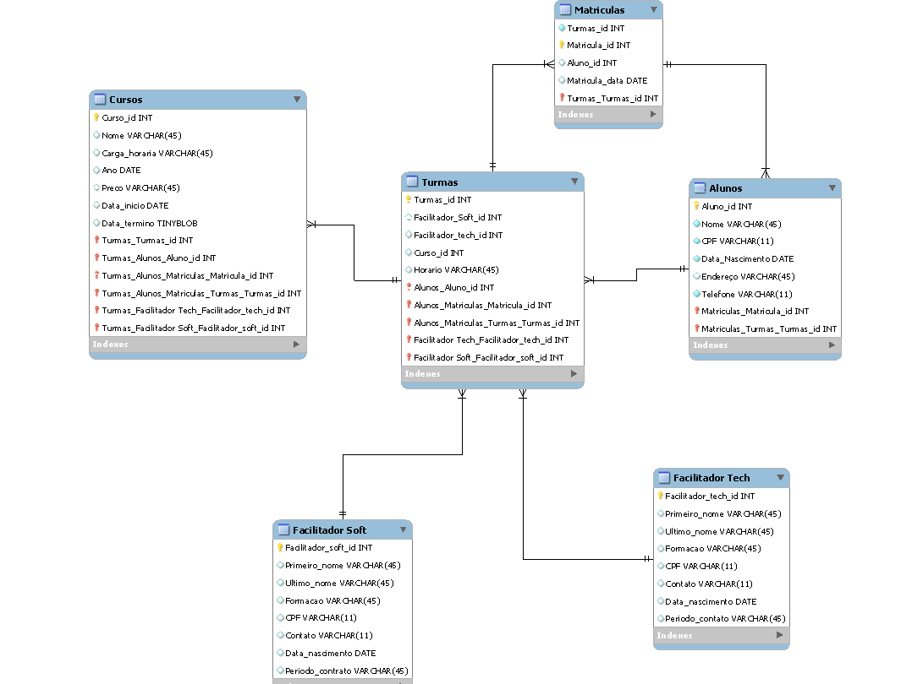

<h1>    Sistema de acompanhamento do Resilia

### Projeto individual do Módulo 4 do curso Programadores Carioca - SENAC-Resilia

#### Contexto:
A Resilia está pensando em lançar um novo sistema de acompanhamento e para isso precisa de ajuda para modelar um banco de dados que vai armazenar sues cursos, turmas e alunos.

#### Existem outras entidades além dessas três?
<ul>
 Sim, considerando o modelo e sistema da instituição, além das entidades CURSOS, TURMAS e ALUNOS que foram solicitadas, foi preciso adicionar mais 4 entidades, sendo elas:

 <li> Facilitador Soft
 <li> Facilitador Hard
 <li> Monitor
 <li> Matrícula 
</ul> 

#### Quais são os principais campos e tipos?

 Os principais campos são os ID de cada entidade (as chaves primárias). A maioria dos campos são INT.

#### Como essas entidades estão relacionadas?

 Dentro da modelagem desenvolvida, elas estão em um relacionamento de 1:n.
